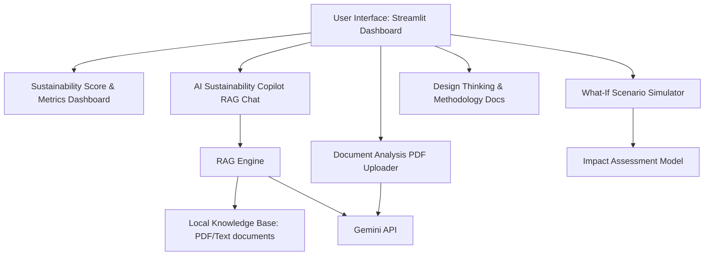

# Implementation Plan - GreenMind AI Sustainability Support System

GreenMind AI is a sustainability-focused decision-support system designed for educational institutions to help them analyze, simulate, and improve their environmental performance in alignment with the UN Sustainable Development Goals (SDGs) and the IBM SkillsBuild + AICTE AI for Sustainability Internship.

---

## User Review Required

> [!IMPORTANT]
> **Tech Stack Selection:**
> We propose using **Python + Streamlit** for this project. Streamlit is highly suited for building rich, interactive dashboard prototypes with AI integrations, PDF uploads, what-if sliders, and chat copilots. It aligns with existing project patterns in your workspace (such as the Judicial Explainer and Traffic Violation apps).
>
> **AI Provider:**
> We propose using the **Google Gemini API** (`google-generativeai` SDK) for the RAG Copilot, PDF analysis, and scoring improvements. It is state-of-the-art and natively supported. We will require a `.env` file with a `GEMINI_API_KEY`.

---

## Open Questions

> [!WARNING]
> **API Key Setup:**
> Do you have an active Gemini API key we can use for development? If not, we can fall back to mock AI responses or a local model, but Gemini will yield the highest quality answers and document summaries.

---

## Proposed Project Architecture

The application will be structured as a multi-page Streamlit dashboard organized around the **Design Thinking Framework** (Empathize, Define, Ideate, Prototype, Test).



### Directory Structure Proposed:
```text
Greenmind_AI/
│
├── .env                  # API Keys & Configuration
├── requirements.txt      # Python dependencies
├── app.py                # Main Entrypoint / Sidebar Navigation
│
├── components/           # UI Component definitions
│   ├── dashboard.py      # Score & general metrics
│   ├── copilot.py        # AI RAG chat
│   ├── doc_analyzer.py   # PDF analysis page
│   ├── simulator.py      # What-if analysis
│   └── methodology.py    # Design Thinking walkthrough
│
├── utils/                # Helper modules
│   ├── ai_helper.py      # Gemini RAG/chat interface & document parsing
│   ├── rag_store.py      # Vector DB / document retriever (FAISS or Simple Cosine Similarity)
│   └── calculations.py   # Math model for what-if scenarios & scoring
│
├── knowledge_base/       # Text/PDF documents for RAG
│   ├── energy_practices.txt
│   ├── water_conservation.txt
│   ├── waste_guidelines.txt
│   └── un_sdgs.txt
│
└── sample_data/          # Example documents for user upload
    ├── sample_energy_audit.pdf
    └── sample_water_consumption.pdf
```

---

## Proposed Changes

### [Core App Structure]

#### [NEW] [requirements.txt](file:///d:/Files%20and%20Docs/B.Tech/Projects/Greenmind_AI/requirements.txt)
Define python dependencies:
* `streamlit`
* `google-generativeai`
* `python-dotenv`
* `pandas`
* `matplotlib` or `plotly` (for gorgeous dashboard charts)
* `pypdf` (for parsing uploaded files)
* `numpy`

#### [NEW] [app.py](file:///d:/Files%20and%20Docs/B.Tech/Projects/Greenmind_AI/app.py)
Main landing page containing the sidebar navigation for:
1. **Sustainability Scorecard & Dashboard** (Overview)
2. **AI Sustainability Copilot** (RAG Q&A Chatbot)
3. **Document Analyzer** (PDF Audit Upload)
4. **What-If Scenario Simulator** (Energy/Water/Waste slider simulator)
5. **Design Thinking Framework & Responsible AI** (Educational/Compliance docs)

---

### [Analytics & Simulation Module]

#### [NEW] [calculations.py](file:///d:/Files%20and%20Docs/B.Tech/Projects/Greenmind_AI/utils/calculations.py)
Implements formulas for:
* **Current Sustainability Score:** Evaluated out of 100 based on resource benchmarks (Electricity: kWh/student, Water: L/student, Waste Recycling %, Carbon Footprint: kg CO2/student).
* **What-If Math Model:**
  * Electricity reduction -> CO2 offset (1 kWh ≈ 0.85 kg CO2) + financial savings.
  * Solar panels (kW) -> Solar generation (1 kW ≈ 4 kWh/day) + offset.
  * Water leakage reduction -> Water saved (liters) + financial savings.
  * Waste recycling -> Landfill diversion rate + score boost.
* **Score Delta:** Calculate improvement in the sustainability scorecard based on recommendations adopted.

---

### [AI & RAG Module]

#### [NEW] [ai_helper.py](file:///d:/Files%20and%20Docs/B.Tech/Projects/Greenmind_AI/utils/ai_helper.py)
* Initialize Gemini API.
* Prompt engineering wrapper for:
  * Document summarization
  * Risk and issue extraction
  * SDG mapping
  * Recommendations generation

#### [NEW] [rag_store.py](file:///d:/Files%20and%20Docs/B.Tech/Projects/Greenmind_AI/utils/rag_store.py)
* A simple in-memory vector/semantic search (or cosine similarity on embeddings) using Gemini embeddings or TF-IDF.
* Loads standard knowledge texts (Policies, Guidelines, SDGs) upon app startup.
* Provides the `retrieve(query, top_k=3)` interface to ground answers.

---

### [User Interface Pages]

#### [NEW] [dashboard.py](file:///d:/Files%20and%20Docs/B.Tech/Projects/Greenmind_AI/components/dashboard.py)
* Displays KPIs (Electricity, Water, Waste, Carbon footprint) using beautiful streamlit metrics and charts.
* Displays the overall Sustainability Score (graded A to F, or 0-100) using a visually appealing radial progress-bar style gauge or colored metric cards.
* Includes the mandatory **Responsible AI & Ethics** statement (explaining fairness, privacy, scoring rules, and prediction limitations).

#### [NEW] [copilot.py](file:///d:/Files%20and%20Docs/B.Tech/Projects/Greenmind_AI/components/copilot.py)
* Streamlit chat interface.
* Retrieves matching passages from `rag_store`.
* Calls Gemini API with the query and retrieved context to formulate grounded answers.
* Displays "Retrieved References" in an accordion component beneath the answer for transparency.

#### [NEW] [doc_analyzer.py](file:///d:/Files%20and%20Docs/B.Tech/Projects/Greenmind_AI/components/doc_analyzer.py)
* Upload control supporting `.pdf` files.
* Extracts text and runs LLM analysis.
* Displays structured response sections: Summary, Identified Risks, Suggested Improvements, SDG Mapping.

#### [NEW] [simulator.py](file:///d:/Files%20and%20Docs/B.Tech/Projects/Greenmind_AI/components/simulator.py)
* User-controlled sliders.
* Live side-by-side bar chart comparisons of "Before" vs "After" resource consumption and carbon emissions.
* Displays dynamic impact highlights (e.g., "Equivalent to planting X trees!").

#### [NEW] [methodology.py](file:///d:/Files%20and%20Docs/B.Tech/Projects/Greenmind_AI/components/methodology.py)
* Interactive workflow diagram of the Design Thinking process.
* System architecture block.
* Sample questions list.

---

## Verification Plan

### Automated / Integration Checks
* Verify Python packages can be installed using a clean virtual environment: `pip install -r requirements.txt`.
* Run validation tests to ensure the calculator outputs correct mathematical proportions for the what-if scenarios.
* Validate PDF extraction utility on sample documents.

### Manual Verification
* Run the Streamlit application: `streamlit run app.py`.
* Walk through each of the 5 pages using a browser session to verify responsiveness, layout premium quality, and correct chart updates.
* Upload a sample sustainability audit report PDF to test extraction.
* Run queries against the RAG Copilot to verify document grounding.
